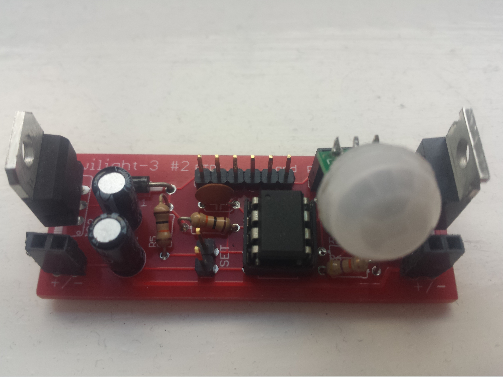

View this project on [CADLAB.io](https://cadlab.io/project/1197). 

Twilight-3
==========

Twilight with attiny85,
[Interrupted](https://github.com/jscrane/Interrupted) and
[Tiny Safe Boot](http://jtxp.org/tech/tinysafeboot_en.htm).

Hardware
--------
The layout in version [#1](https://cadlab.io/project/1197/6bfdd5cf1f4ba5d0182bede7adce6e52f376f4fe/circuit/ZWFnbGUvdHdpbGlnaHQzLmJyZA%3D%3D) is broken, 
there's a short in the power circuit. (Never ignore ERC warnings!)

Version [2](https://cadlab.io/project/1197/2f3ed3901fa7b14418fc2b612dbf1835c0194fca/circuit/ZWFnbGUvdHdpbGlnaHQzLmJyZA%3D%3D) has been built and tested. 
Depending on the PIR sensor used, the 22k resistor is optional. If present,
it drags down the output of 
[Mini-PIRs](https://www.futurlec.com/Mini_PIR_Module.shtml) too much.

Version [3](https://cadlab.io/project/1197/9cf4fb193adf9d36c94b128c8913e801d072b348/circuit/ZWFnbGUvdHdpbGlnaHQzLmJyZA%3D%3D) improves the layout some more
but is (so far) untested.

